<style scoped>
img { 
    vertical-align: middle; 
    padding: 0.5cm;
}
footer {
  right: 50px;
  height: 20px;
  bottom: 100px;
}
</style>

<!-- _paginate: skip -->
<!-- _footer: " " -->
<!-- _class: invert title -->

# **Enter The Donjon** 
# A practical laser attack on the go
## Workshop 06 - Grehack 24


---

<!-- header: "Agenda" -->

# Agenda

## Fault injection principles
## Attack of the OneKey Mini
## Live execution
## Workarounds and questions

---

<!-- header: "Fault injection principles" -->

<style scoped>
img { 
    vertical-align: middle; 
}
span.emoji {
  font-size: 2cm;
  vertical-align: middle;
  line-height: 1;
}
</style>

# Fault Injection? What is it?

<div style="margin-top: 3cm;">

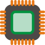 Hardware

<span class="emoji">⚡️</span>Physical perturbation 

 Process deflection

</div>

--- 

# Unauthorized access

<style scoped>
table, th, td, tr {
  border-color: transparent;
  margin: 2cm auto 0 auto;
  padding:0;
  text-align:center;
  line-height:1;
  
}
section tr:nth-child(even) {background-color: transparent;}
section tt {
  background-color:transparent;
  padding:0;
}
</style>

<TABLE border="1">
<TR>
<TD rowspan="3">  </TD>
<TD style="height:2cm"></TD>
<TD rowspan="3">  </TD>
</TR>
<TR>
  <TD><tt>-------------------></tt></TD>
</TR>
<TR> 
    <TD style="height:2cm"></TD>
<TR> 
</TR>
  <TD><tt>^</tt><br/><tt>|</tt></TD>
  <TD style="vertical-align:bottom"></TD>
  <TD><tt>|</tt><br/><tt>|</tt></TD>
</TR>
<TR> 
  <TD>
  <TD colspan="2" style="text-align:left;vertical-align:top"><tt>                          |</tt><br/><tt><-------------------------+</tt><br/></TD>
</TR>
</TABLE>


---

# Unauthorized access - **Faulted**

<style scoped>
table, th, td, tr {
  border-color: transparent;
  margin: 2cm auto 0 auto;
  padding:0;
  text-align:center;
  line-height:1;  
}
section tr:nth-child(even) {background-color: transparent;}
section code, section tt {
  background-color:transparent;
  padding:0;
}

span.emoji {
  font-size: 2cm;
  vertical-align: middle;
  line-height: 1;
}
</style>

<TABLE border="1">
<TR>
<TD rowspan="3">  </TD>
<TD style="height:2cm"><span class="emoji">⚡️</span></TD>
<TD rowspan="3">  </TD>
</TR>
<TR>
  <TD><tt>-------------------></tt></TD>
</TR>
<TR> 
    <TD style="height:2cm"></TD>
<TR> 
</TR>
  <TD><tt>^</tt><br/><tt>|</tt></TD>
  <TD style="vertical-align:bottom"></TD>
  <TD><tt>|</tt><br/><tt>|</tt></TD>
</TR>
<TR> 
  <TD>
  <TD colspan="2" style="text-align:left;vertical-align:top"><tt>                          |</tt><br/><tt><-------------------------+</tt><br/></TD>
</TR>
</TABLE>

----

<style scoped>
section th {
    font-size: 35px
}
section td {
    color: gray;
    background-color: #ffffff22;
}
section tr:nth-child(even) {
    background-color: #ffffff22;
}
</style>

# ⚡️ Physical perturbation types

| Power glitch | FBBI | EMFI | Laser
| :---: | :---: | :---: | :---: 
| Power cut | Voltage on the die | EM field | Illumination
| 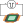 |  |  | 

----

<!-- _header: "" -->
<!-- _footer: "" -->
<!-- _class: invert title -->
<!-- _paginate: skip -->

# Attack of the OneKey Mini

## **Laser on ATECC**

----

<!-- header: "Attack of the OneKey Mini" -->
<!-- _class: invert -->

# The Target Of Evaluation

<div style="display:flex; align-items:end; margin-top: auto; margin-bottom: auto;">

<figure style="display:flex; align-items:center; flex-direction:column; flex:auto;">
<div style="height:10cm; width:5cm; display:flex; align-items:center; gap:1cm;">
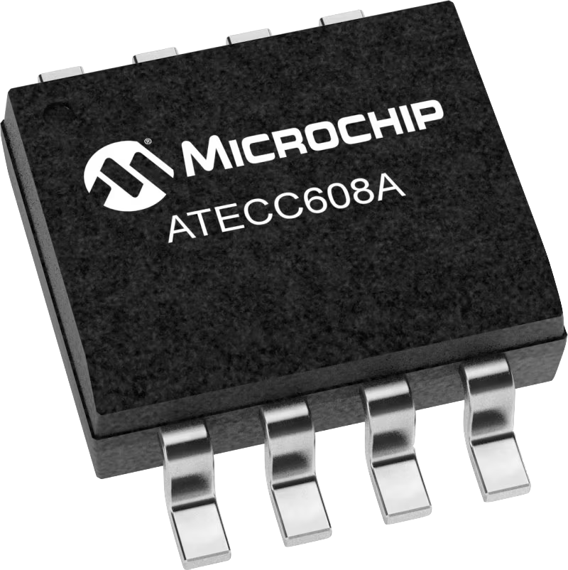
</div>
<figcaption style="color:rgb(106,125,126); text-align: center;">ATECC608A</figcaption>
</figure>	

<figure style="display:flex; align-items:center; flex-direction:column; flex:auto">
<div style="display:flex; flex-direction:row; align-items:center; gap:1cm;">
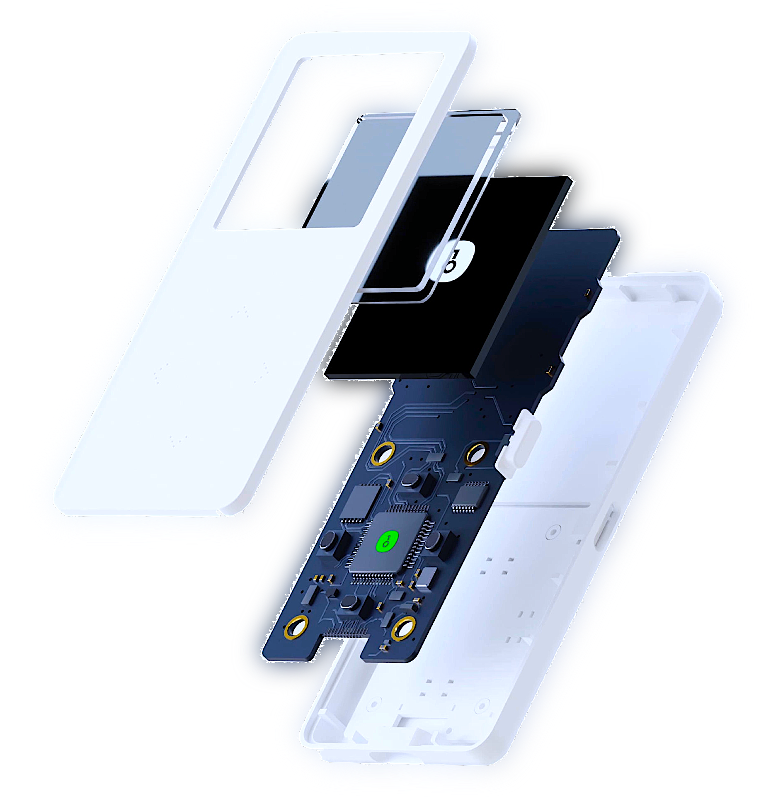
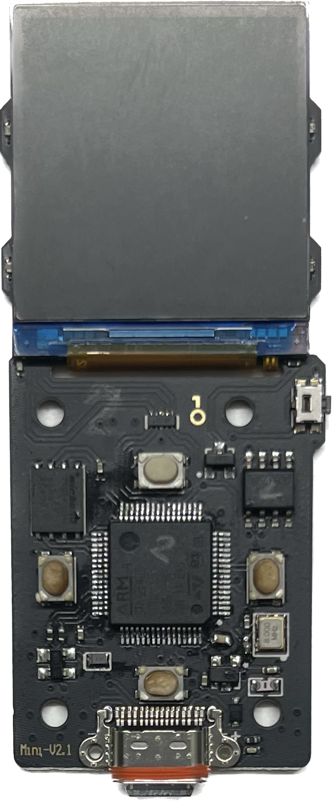
</div>
<figcaption style="margin:auto; text-align: center; color:rgb(106,125,126)">One Key Mini</figcaption>
</figure>


</div>

----

# The Bench

<div style="display:flex; align-items:end; margin-top: auto; margin-bottom: auto;">

<figure style="display:flex; align-items:center; flex-direction:column; flex:auto">
<div style="display:flex; flex-direction:row; gap:1cm;">

</div>
<figcaption style="text-align:center; color:rgb(106,125,126)">Laser Bench</figcaption>
</figure>

<figure style="display:flex; align-items:center; flex-direction:column; flex:auto">
<div style="display:flex; flex-direction:row; gap:1cm;">

</div>
<figcaption style="text-align:center; color:rgb(106,125,126)">Daughter Board</figcaption>
</figure>	
</div>

----

# The Attack

<div style="--color-prettylights-syntax-comment:green;">

```python
# Authorized request
atecc.nonce()
atecc.gen_dig(1, atecc.KEY_SLOT1)
atecc.read(slot=6) ^ atecc.temp_key
# SUCCESS
```
</div>

<div style="--color-prettylights-syntax-comment:firebrick;">

```python
# Unauthorized request
atecc.nonce()
atecc.gen_dig(14, atecc.KEY_SLOT14)
atecc.read(slot=6) ^ atecc.temp_key 
# EXECUTION_ERROR
```
</div>

<div style="--color-prettylights-syntax-comment:orange;">

```python
# Faulted request
atecc.nonce()
atecc.gen_dig(14, atecc.KEY_SLOT14)
atecc.read(slot=6, trigger=I2CTrigger.END.value) ^ atecc.temp_key
# EXECUTION_ERROR / TIMEOUT / SUCCESS / ...
```
</div>

---

# The Attack

<figure style="display:flex; align-items:center; flex-direction:row; flex:auto; gap:5mm">
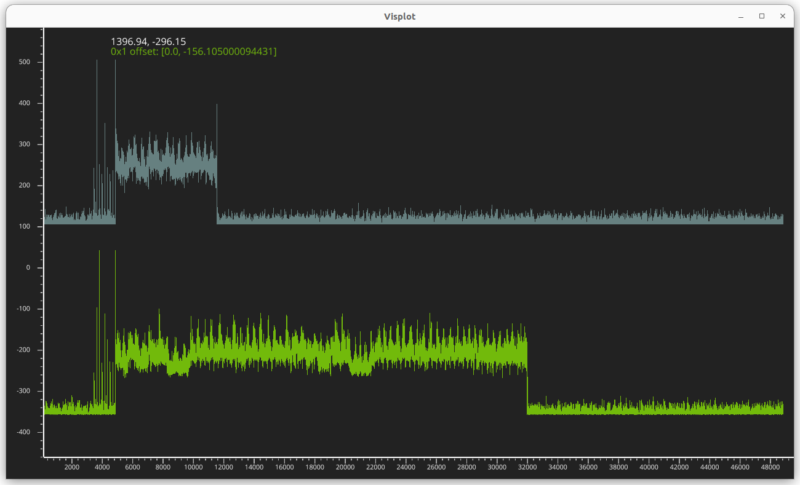

<div style="display:flex; align-items:start; flex-direction:column; flex:auto; gap:3cm">
<figcaption style="text-align:left; display:flex; align-items:start; flex-direction:column; flex:auto; gap:3cm;"><span style="color:rgb(106,125,126)">Unauthorized access</span><span style="color:rgb(131,184,57)">Authorized access</span></figcaption>
</div>
</figure>

---

<!-- header: "Live execution" -->
<!-- _class: invert title -->

# Let's do it!

---

<style scoped>
section figure {
  margin: 3mm auto;
  display: flex;
  flex-flow: row;
  align-items: center;
}
section figcaption {
  font-size: 0.7em;
  text-align: center;
  font: smaller sans-serif;
  padding-left:1em;
  text-align: center;
}
section img {
  width:16cm
}
</style>

# Perturbed executions

<figure>
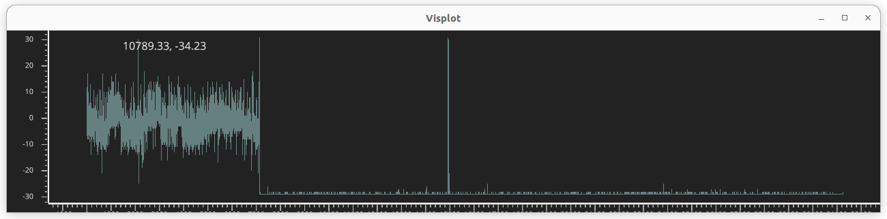
<figcaption style="color:rgb(106,125,126)">No perturbation</figcaption>
</figure>	

<figure>
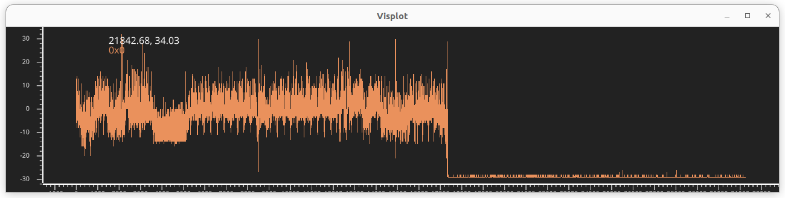
<figcaption style="color:rgb(222,149,102)">One perturbation</figcaption>
</figure>

<figure>
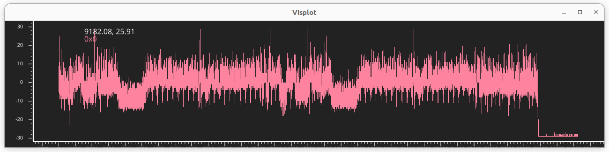
<figcaption style="color:rgb(238,138,159)">Two perturbations</figcaption>
</figure>

---

# Scan Result **~1 day execution**

<div style="margin:auto; display: flex; gap:1cm; align-items:center;">

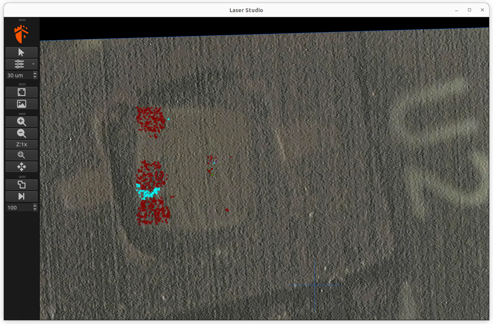

<div style="display: flex; flex-direction: column">
<span>No effect: Transparent</span>
<span style="color:rgb(0,255,0)">SUCCESS</span>
<span style="color:rgb(128, 0, 0)">I2C Nack</span>
<span style="color:rgb(255, 0, 0)">Timeout</span>
<span style="color:rgb(128, 0, 128)">ECC_FAULT</span>
<span style="color:rgb(0, 255, 255)">AFTER_WAKE</span>
<span style="color:rgb(0, 0, 128)">HEALTH_TEST_ERROR</span>
<span style="color:rgb(128, 128, 0)">PARSE_ERROR</span>
</div>
</div>

---

# Scan Result  **ATECC608B / AES**

<div style="margin:auto">

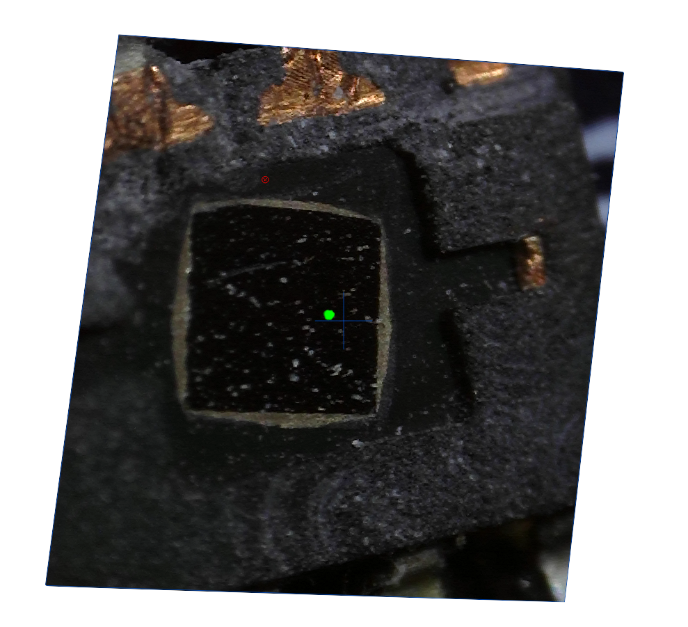
</div>

---

# Scan Result **ATECC508A**

<div style="display:flex; flex-direction:row; gap: 1cm;align-items:center; margin:auto">


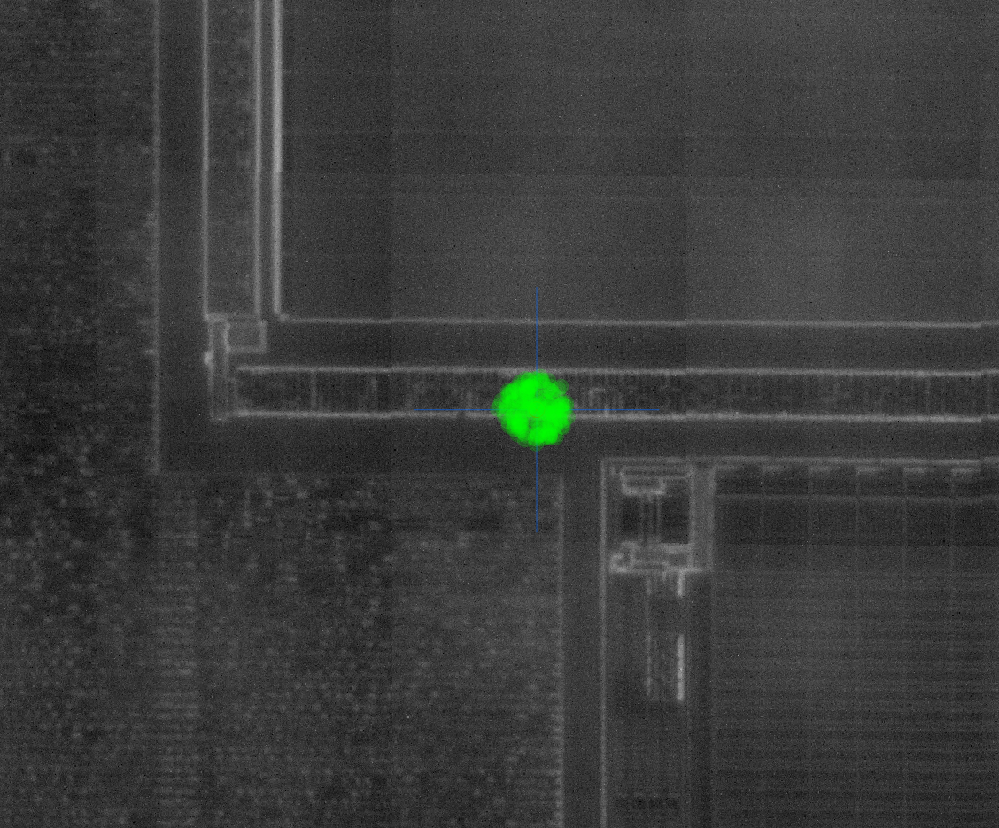

</div>
</div>

---

<!-- header: "Corrections and countermeasures" -->
<!-- _class: invert title -->

# Corrections and countermeasures

---

# From the chip provider

## Physical countermeasures

- Jitter
- Laser detectors
- Fault counting...

# From the have a good configuration

## Lock any

## 

---
